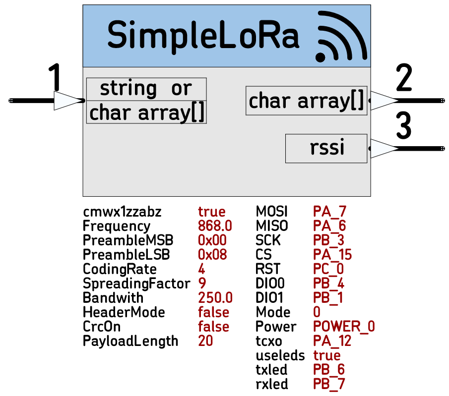

# SimpleLoRa
SubGHz Radio with LoRa modulation. 

SubGHz Radio with LoRa modulation. Will work on boards based on Murata CMWX1ZZABZ and potentially, on boards with mbed supported Microprocessor and SX1276 radio.
This Node Supports the long range LoRa modulation, not a Wide Area Network protocol.
 *  Category: Radio
 *  HAL: mbed
 *  Tested: CMWX1ZZABZ (Murata Module SX1276, STM32L072, TCXO), n-PRO-40, n-DAP
 *  Author: N. Chalikias

## Input /Output data types 
If the node is used as TX and the input is array of char, it will have the same format as the output of the RX node, so the two radio nodes become transparent.  
If the input in TX node is string, the RX node will convert it to array of char, so the output of RX will not be the of the same type.  

## Input
 *  (Schematic pin 1) two options, Pointer to:
     *  *string
     *  *array
## Outputs
 *  (Schematic pin 2) *array of char: Payload
 *  (Schematic pin 3)  int: RSSI of the received Payload

## Parameters:
 *  cmwx1zzabz: bool: true for CMWX1ZZABZ, false for SX1276 without TCXO module
 *  Frequency: float: 137.0 to 1020.0 MHz for SX1276, 860-930MHz for CMWX1ZZABZ (due to antenna matching)
 *  PreambleMSB: uint8_t: 0 to 0xFF, number of preamble transmission symbols
 *  PreambleLSB: uint8_t: 6 to 0xFF,  number of preamble transmission symbols
 *  CodingRate: uint8_t: 5, 6, 7, 8
 *  SpreadingFactor: uint8_t: 6, 7, 8, 9, 10, 11, 12
 *  Bandwidth: float: 7.8, 10.4, 15.6, 20.8, 31.25, 41.7, 62.5, 125, 250 500 kHz
 *  HeaderMode: bool: 
 *  CrcOn: bool: 
 *  PayloadLength: uint8_t: 1 to 255 bytes for SX1276, 32 current limit for the Node to save RAM 
 *  MOSI: PinName: Microcontroller pin to SX1276
 *  MISO : PinName: Microcontroller pin to SX1276
 *  SCK : PinName: Microcontroller pin to SX1276
 *  CS : PinName: Microcontroller pin to SX1276
 *  RST : PinName: Microcontroller pin to SX1276
 *  DIO0 : PinName: Microcontroller pin to SX1276
 *  DIO1 : PinName: Microcontroller pin to SX1276
 *  Mode: uint8_t: 0 RX and when Input is triggered TX the packet, 1 TX only, 2 RX only
 *  Power: PowerTx: POWER_MIN1, POWER_0, POWER_2, POWER_5, POWER_8, POWER_10, POWER_15, POWER_17, POWER_20  in dBm
 *  tcxo: PinName: Microcontroller pin to CMWX1ZZABZ TCXO
 *  useleds: bool: true for using leds
 *  ledtx: PinName: TX LED
 *  ledtx: PinName: RX LED

## Example:
Transmitter:  [Ticker]-->[Counter]-->[StringFormat]-->[SimpleLoRa]-->RF )))    
Receiver:  ((( RF--> [SimpleLoRa]-->[StringSerial]

